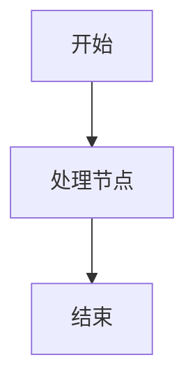
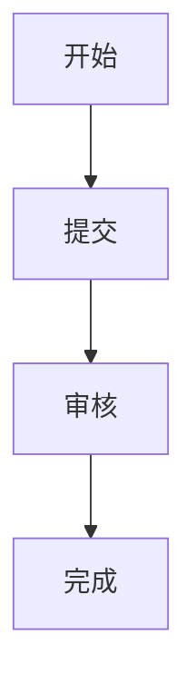
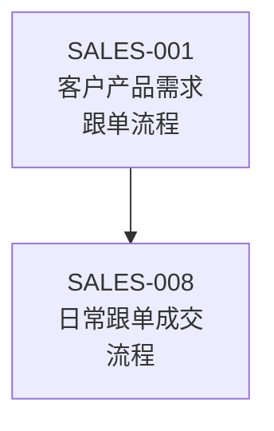
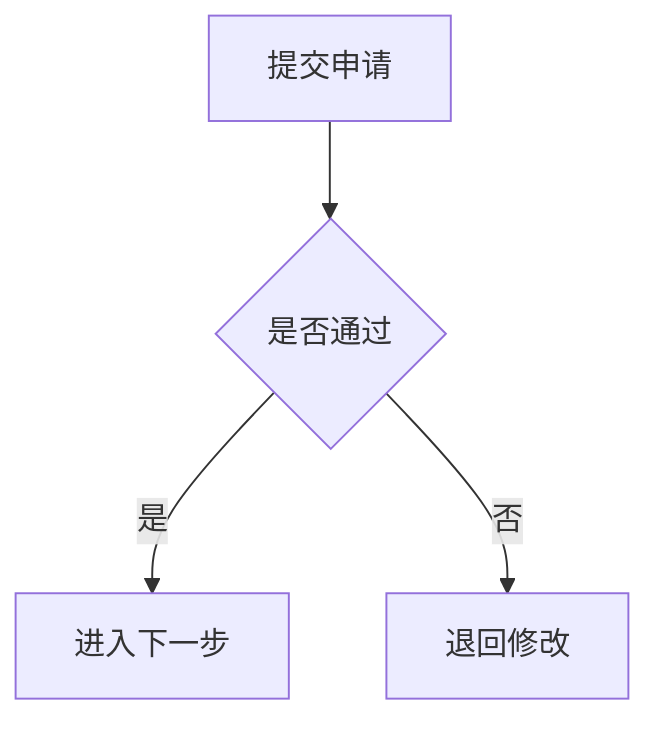
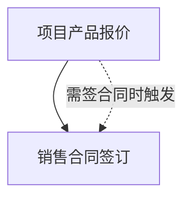
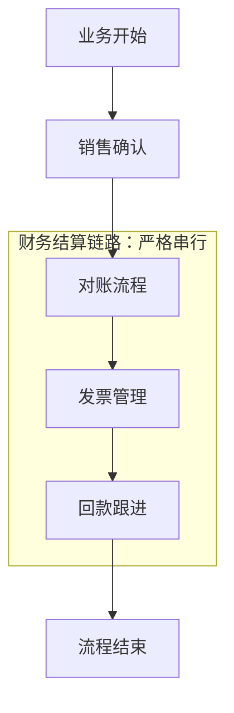

# Markdown Flowchart Writer

## Purpose

Create maintainable Markdown process documents and flowcharts. This skill is optimized for Chinese business documents, internal SOPs, CRM/ERP modules, sales workflows, finance workflows, approval workflows, contract workflows, order workflows, after-sales workflows, and system-operation documents.

The main goal is to avoid broken alignment caused by tabs, spaces, mixed Chinese/English characters, and platform-specific fonts. Diagrams must be written as Mermaid unless the user explicitly requests another format.

## Core Rules

1. Never use ASCII art, box-drawing characters, tabs, or space-aligned diagrams for process charts.
2. Always use Mermaid fenced code blocks for flowcharts.
3. Use `flowchart TD` by default.
4. Use `flowchart LR` only for short, strictly left-to-right chains.
5. Use concise Chinese labels inside nodes.
6. Use short English node IDs, such as `A`, `B`, `Contract`, `Invoice`, `Payback`.
7. Use `<br/>` for line breaks inside node labels.
8. Use `subgraph` for grouped chains, such as finance settlement, contract workflow, delivery workflow, after-sales workflow, or monthly recurring workflow.
9. Use dashed arrows for optional, triggered, explanatory, or conditional relationships.
10. Keep detailed descriptions outside the diagram. Do not overload nodes with long text.
11. If a diagram has more than 20 nodes, split it into multiple diagrams.
12. Add a step table after complex diagrams so readers can understand responsibilities, inputs, outputs, and status changes.
13. If information is ambiguous, make reasonable assumptions and add a “待确认事项” section.

## Output Style

- Use clean Markdown.
- Prefer Chinese section titles for Chinese business documents.
- Keep business language concise, clear, and implementation-oriented.
- Do not output explanations outside the document unless the user asks.
- Do not use tabs in Markdown.
- Do not use ASCII diagrams.
- Keep Markdown suitable for Git version control.

## Standard Document Structure

When the user asks for a complete process document, use this structure:

```markdown
# 文档标题

## 1. 背景说明

说明为什么需要这个流程，以及它解决什么问题。

## 2. 适用范围

说明适用于哪些部门、角色、业务场景或系统模块。

## 3. 角色职责

| 角色 | 职责 |
|---|---|
| 角色名称 | 具体职责 |

## 4. 流程总览



## 5. 流程步骤

| 步骤 | 操作角色 | 操作说明 | 输入 | 输出 | 状态变化 | 备注 |
|---|---|---|---|---|---|---|
| 1 |  |  |  |  |  |  |

## 6. 关键规则

- 规则一
- 规则二

## 7. 异常处理

| 异常场景 | 处理方式 | 责任人 |
|---|---|---|
|  |  |  |

## 8. 权限说明

| 操作 | 可操作角色 | 权限说明 |
|---|---|---|
|  |  |  |

## 9. 数据字段

| 字段 | 类型 | 是否必填 | 说明 |
|---|---|---|---|
|  |  |  |  |

## 10. 检查清单

- [ ] 流程是否完整
- [ ] 角色是否清晰
- [ ] 状态是否闭环
- [ ] 异常场景是否覆盖
- [ ] Mermaid 图是否可渲染
- [ ] 是否没有使用 Tab 或 ASCII 流程图
```

## Mermaid Flowchart Rules

### Basic Pattern



### Chinese Node Line Breaks

Use `<br/>` inside labels:



### Conditional Branch



### Triggered Relationship

Use dashed arrows for trigger notes:



### Grouped Process



## ASCII-to-Mermaid Conversion Process

When converting an existing ASCII diagram:

1. Identify all nodes.
2. Identify start nodes and end nodes.
3. Identify arrows and dependencies.
4. Identify optional or triggered relationships.
5. Identify grouped chains.
6. Rewrite as Mermaid.
7. Add explanatory notes outside the diagram if needed.
8. Add a process step table if the workflow is business-critical.
9. Add “待确认事项” for unclear relationships.
10. Confirm that no ASCII diagram remains.

## Quality Checklist

Before final output, check:

- [ ] No hard tabs are used.
- [ ] No ASCII-art flowchart remains.
- [ ] Every Mermaid node has a valid ID.
- [ ] Every arrow has a source and target.
- [ ] Chinese labels are inside node brackets.
- [ ] Long Chinese node labels use `<br/>`.
- [ ] Complex chains use `subgraph` where appropriate.
- [ ] Triggered/optional flows use dashed arrows.
- [ ] The process has either a clear start and end, or the open-ended loop is clearly marked.
- [ ] Business roles, states, inputs, and outputs are clear when writing a full process document.

## Common User Prompts This Skill Should Handle

- “把这个 ASCII 流程图改成 Mermaid。”
- “帮我写一个 Markdown 流程文档。”
- “这个 Markdown 中的流程图中文对不齐，帮我优化。”
- “帮我整理销售流程、合同流程、财务流程。”
- “帮我把制度文档改成适合 Git 管理的 Markdown。”
- “帮我检查 Mermaid 是否可读、是否规范。”

## Default Response Pattern

For a conversion request, return:

1. A short note explaining that the ASCII diagram has been converted to Mermaid.
2. The Mermaid code block.
3. A concise relationship summary.
4. Any assumptions or pending confirmations.

For a full document request, return the complete Markdown document using the standard structure.
