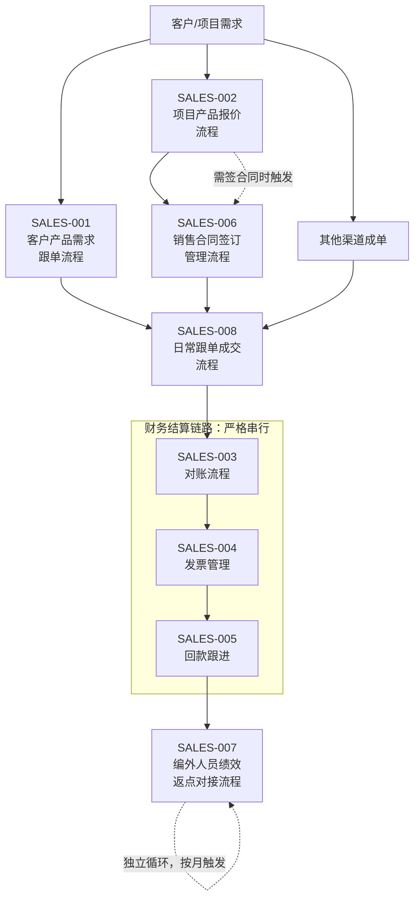

# Mermaid 流程图示例：推荐

```mermaid
flowchart TD
    A[客户/项目需求]

    A --> B[SALES-001<br/>客户产品需求<br/>跟单流程]
    A --> C[SALES-002<br/>项目产品报价<br/>流程]
    A --> D[其他渠道成单]

    C --> E[SALES-006<br/>销售合同签订<br/>管理流程]
    C -. 需签合同时触发 .-> E

    B --> F[SALES-008<br/>日常跟单成交<br/>流程]
    E --> F
    D --> F

    subgraph Finance[财务结算链路：严格串行]
        G[SALES-003<br/>对账流程] --> H[SALES-004<br/>发票管理]
        H --> I[SALES-005<br/>回款跟进]
    end

    F --> G
    I --> J[SALES-007<br/>编外人员绩效<br/>返点对接流程]
    J -. 独立循环，按月触发 .-> J
```
