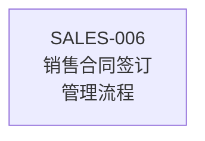
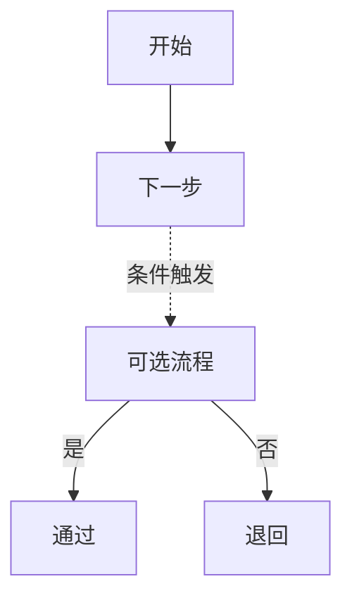
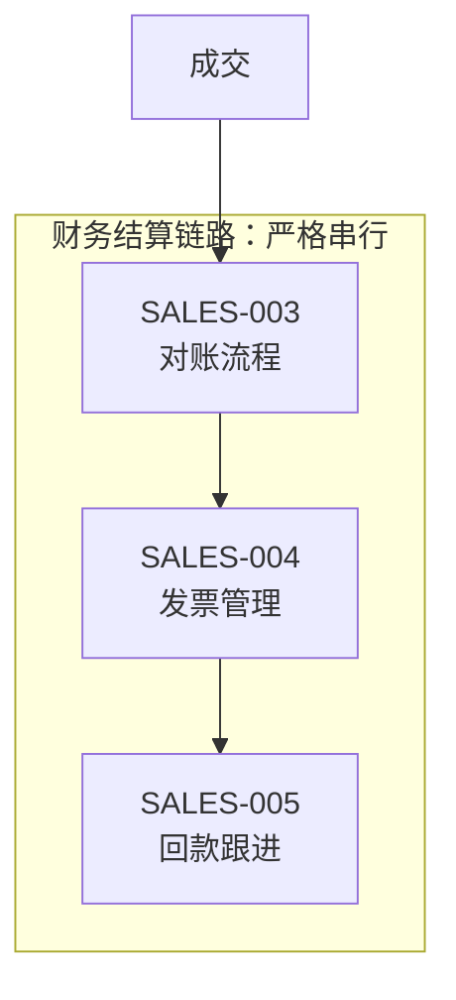

# Mermaid Style Guide for Chinese Markdown Documents

## General Principles

- Prefer `flowchart TD` for business processes.
- Use `flowchart LR` for short serial chains.
- Keep node IDs in English and labels in Chinese.
- Keep labels short.
- Use ` ` for line breaks in nodes.
- Use `subgraph` for grouped process chains.
- Use dashed arrows for triggered or optional relationships.

## Node Naming

Good:

Avoid:

## Arrow Types

## Subgraph Example

## Avoid

- ASCII art.
- Tabs for alignment.
- Long paragraphs inside nodes.
- Too many crossing arrows.
- More than 20 nodes in one diagram.
