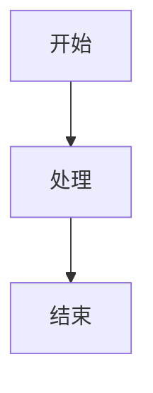

# 《流程名称》流程文档

## 1. 背景说明

说明流程建立的背景、目标和解决的问题。

## 2. 适用范围

说明适用部门、岗位、系统模块、业务场景。

## 3. 角色职责

| 角色 | 职责 |
|---|---|
|  |  |

## 4. 流程总览

## 5. 流程步骤

| 步骤 | 操作角色 | 操作说明 | 输入 | 输出 | 状态变化 | 备注 |
|---|---|---|---|---|---|---|
| 1 |  |  |  |  |  |  |

## 6. 关键规则

- 

## 7. 异常处理

| 异常场景 | 处理方式 | 责任人 |
|---|---|---|
|  |  |  |

## 8. 权限说明

| 操作 | 可操作角色 | 权限说明 |
|---|---|---|
|  |  |  |

## 9. 数据字段

| 字段 | 类型 | 是否必填 | 说明 |
|---|---|---|---|
|  |  |  |  |

## 10. 待确认事项

- [ ] 

## 11. 检查清单

- [ ] 流程是否完整
- [ ] 角色是否清晰
- [ ] 状态是否闭环
- [ ] 异常场景是否覆盖
- [ ] Mermaid 图是否可渲染
- [ ] 是否没有使用 Tab 或 ASCII 流程图
